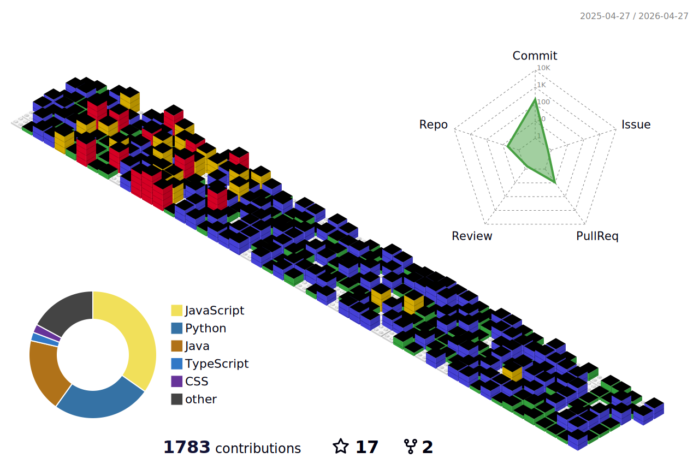

  <picture>
  <source media="(prefers-color-scheme: dark)" srcset="https://github-contribution-stats.vercel.app/api?username=SafferStha&theme=github_dark" />
  <source media="(prefers-color-scheme: light)" srcset="https://github-contribution-stats.vercel.app/api?username=SafferStha&&theme=light" />
  
  </picture> 

  <picture>
  <source media="(prefers-color-scheme: dark)" srcset="https://github-profile-summary-cards.vercel.app/api/cards/profile-details?username=SafferStha&theme=dark&hide_border=true" />
  <source media="(prefers-color-scheme: light)" srcset="https://github-profile-summary-cards.vercel.app/api/cards/profile-details?username=SafferStha&theme=graywhite&hide_border=true" />
  
  </picture> 

  <picture>
  <source media="(prefers-color-scheme: dark)" srcset="https://github-contributor-stats.vercel.app/api?username=SafferStha&limit=5&theme=dark&combine_all_yearly_contributions=true&hide_border=true" />
  <source media="(prefers-color-scheme: light)" srcset="https://github-contributor-stats.vercel.app/api?username=SafferStha&limit=5&theme=graywhite&combine_all_yearly_contributions=true&hide_border=true" />
  
  </picture>
  <picture>
  <source media="(prefers-color-scheme: dark)" srcset="https://github-readme-stats.vercel.app/api/top-langs/?username=SafferStha&theme=dark&hide_border=true&include_all_commits=true&count_private=true&layout=donut&langs_count=6" />
  <source media="(prefers-color-scheme: light)" srcset="https://github-readme-stats.vercel.app/api/top-langs/?username=SafferStha&theme=graywhite&hide_border=true&include_all_commits=true&count_private=true&layout=donut&langs_count=6" />
  
  </picture> 

  <picture>
  <source media="(prefers-color-scheme: dark)" srcset="https://github-profile-summary-cards.vercel.app/api/cards/productive-time?username=SafferStha&theme=dark&hide_border=true&utcOffset=5.45" />
  <source media="(prefers-color-scheme: light)" srcset="https://github-profile-summary-cards.vercel.app/api/cards/productive-time?username=SafferStha&theme=graywhite&hide_border=true&utcOffset=5.45" />
  
  </picture>
  <picture>
  <source media="(prefers-color-scheme: dark)" srcset="https://streak-stats.demolab.com?user=SafferStha&theme=dark&hide_border=true&short_numbers=true&mode=weekly&ring=EBEBEB&fire=EBEBEB&currStreakLabel=EBEBEB" />
  <source media="(prefers-color-scheme: light)" srcset="https://github-readme-streak-stats.herokuapp.com?user=SafferStha&theme=graywhite&short_numbers=true&hide_border=true&mode=weekly" />
  
  </picture> 

  

  
Top Languages

  <picture>
  <source media="(prefers-color-scheme: dark)" srcset="https://github-profile-summary-cards.vercel.app/api/cards/repos-per-language?username=SafferStha&theme=dark&hide_border=true" />
  <source media="(prefers-color-scheme: light)" srcset="https://github-profile-summary-cards.vercel.app/api/cards/repos-per-language?username=SafferStha&theme=graywhite&hide_border=true" />
  
  </picture>
  <picture>
  <source media="(prefers-color-scheme: dark)" srcset="https://github-profile-summary-cards.vercel.app/api/cards/most-commit-language?username=SafferStha&theme=dark&hide_border=true" />
  <source media="(prefers-color-scheme: light)" srcset="https://github-profile-summary-cards.vercel.app/api/cards/most-commit-language?username=SafferStha&theme=graywhite&hide_border=true" />
  
  </picture> 
  

  <picture>
  <source media="(prefers-color-scheme: dark)" srcset="https://github-readme-activity-graph.vercel.app/graph?username=SafferStha&theme=high-contrast&bg_color=none&area=true&hide_border=true" />
  <source media="(prefers-color-scheme: light)" srcset="https://github-readme-activity-graph.vercel.app/graph?username=SafferStha&bg_color=ffffff&color=000000&line=000000&point=000000&area=true&area_color=000000&hide_border=true)" />
  
  </picture>

<picture>
  <source media="(prefers-color-scheme: dark)" srcset="profile-3d-contrib/profile-night-green.svg">
  <source media="(prefers-color-scheme: light)" srcset="profile-3d-contrib/profile-green-animate.svg">
  
</picture>

<picture>
    <source media="(prefers-color-scheme: dark)" srcset="https://raw.githubusercontent.com/SafferStha/SafferStha/output/github-contribution-grid-snake-dark.svg">
    <source media="(prefers-color-scheme: light)" srcset="https://raw.githubusercontent.com/SafferStha/SafferStha/output/github-contribution-grid-snake.svg">
    
</picture>
