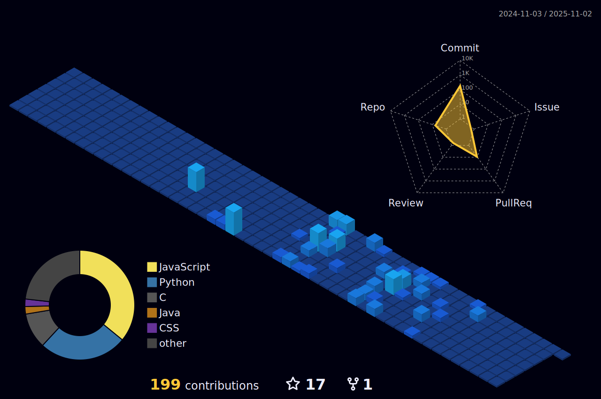

<picture>
    <source media="(prefers-color-scheme: dark)" srcset="https://raw.githubusercontent.com/SafferStha/SafferStha/output/github-contribution-grid-snake-dark.svg">
    <source media="(prefers-color-scheme: light)" srcset="https://raw.githubusercontent.com/SafferStha/SafferStha/output/github-contribution-grid-snake.svg">
    
</picture>

